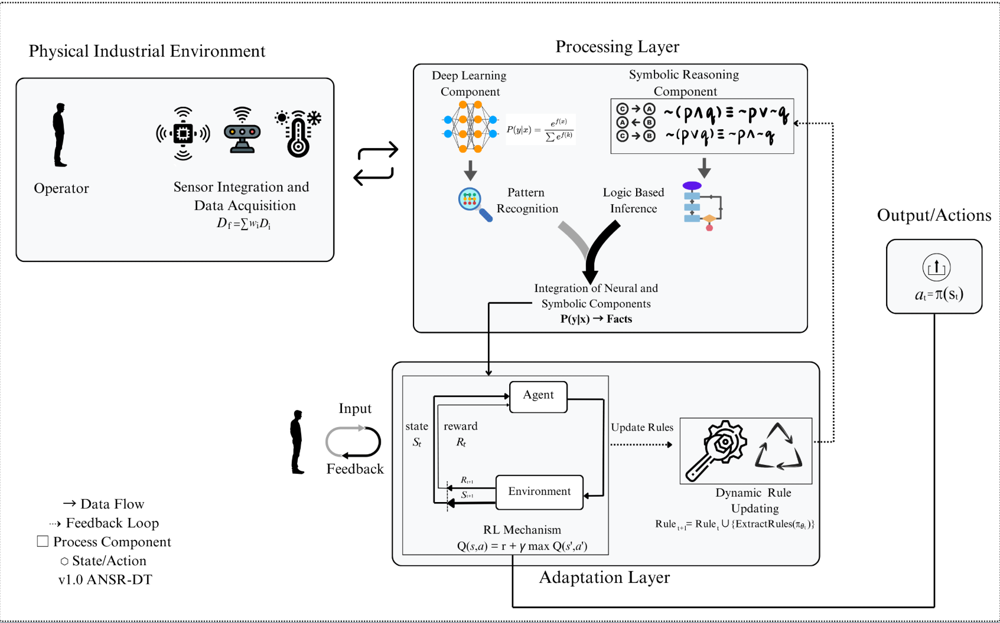

## ANSR-DT

[](https://github.com/mana121/ansr-dt/blob/main/LICENSE)
[](https://www.python.org/downloads/release/python-380/)
[](https://problog.readthedocs.io/en/latest/)


## 📚 Table of Contents

- [Project Overview](#Project-Overview)
- [Features](#Features)
- [Architecture](#Architecture)
- [Installation](#installation)
- [Getting Started](#Getting-Started)
- [Usage](#usage)
- [Project Structure](#Project-Structure)
- [Contributing](#Contributing)
- [License](#License)
- [Contact](#Contact)

## Project Overview


**ANSR-DT** (**A**daptive **N**euro-**S**ymbolic Learning and **R**easoning Framework for **D**igital **T**wins) (formerly NEXUS-DT) is an open-source framework designed to enable real-time learning, adaptive decision-making, and interpretable human-machine collaboration. It integrates:

- **CNN-LSTM Models**: For spatial and temporal pattern recognition.
- **Reinforcement Learning**: Proximal Policy Optimization (PPO) for adaptive control in dynamic environments.
- **Symbolic Reasoning**: Prolog-based rule integration for logical and interpretable decisions.
- **Dynamic Rule Updates**: Continuously evolves symbolic rules based on new data and patterns.

ANSR-DT combines neural networks, reinforcement learning, and symbolic reasoning to enhance decision accuracy, adaptability, and interpretability for digital twin applications.

## Features

- **Pattern Recognition**: Employs CNN-LSTM models with attention mechanisms to capture spatial and temporal patterns in sensor data.
- **Adaptive Decision-Making**: Utilizes PPO (Proximal Policy Optimization) for continuous learning and dynamic system adaptation.
- **Symbolic Reasoning**: Integrates Prolog-based rule reasoning for logical clarity, interpretability, and transparent decision-making.
- **Dynamic Rule Updates**: Continuously evolves symbolic rules based on neural outputs and changing operational conditions.
- **Comprehensive Evaluation**: Includes precision, recall, F1-score, ROC-AUC metrics, and adaptation performance analyses.
- **Visualization Tools**: Provides utilities for data insights, rule activations, state transitions, and model performance trends.
- **Open Source**: Fully documented implementation with examples for reproducibility and further research.

## Architecture

The ANSR-DT framework consists of modular layers that facilitate anomaly detection and adaptive control. Below is the framework architecture:



This diagram highlights key components such as the physical environment layer, processing layer, and adaptation layer, showing data flow and dynamic adaptation mechanisms.

The ANSR-DT system is modular, comprising the following key components:

1.  **Configuration Management**
    - Handles loading and validating YAML configuration files.

2.  **Core Functionality**
    - Integrates neural models, reinforcement learning agents, symbolic reasoning, and adaptive controllers.
    - Manages state updates, decision-making processes, and maintains historical data.

3.  **Reinforcement Learning**
    - Custom Gym environment tailored for ANSR-DT.
    - Scripts for training PPO agents using Stable Baselines3.

4.  **Visualization**
    - Tools for visualizing model features, training metrics, rule activations, and knowledge graphs.

5.  **Symbolic Reasoning**
    - Prolog-based reasoning integrated with neural components.
    - ProbLog for probabilistic logic programming and uncertainty handling.

6.  **Evaluation**
    - Comprehensive evaluation metrics and visualization of model performance and rule effectiveness.

7.  **Utilities**
    - Model saving/loading, scaler management, and other helper functions.

8.  **Integration and Execution**
    - Orchestrates the training, evaluation, reasoning, and visualization processes.

## Installation

### 📋 Prerequisites

- Python 3.8 or higher
- [Anaconda](https://www.anaconda.com/) (recommended for environment management)
- Prolog (e.g., [SWI-Prolog](https://www.swi-prolog.org/))
- [ProbLog](https://problog.readthedocs.io/en/latest/)

## Getting Started

### 📝 Steps

1.  **Clone the Repository**
    ```bash
    git clone [https://github.com/sbhakim/ansr-dt.git](https://github.com/sbhakim/ansr-dt.git) 
    cd ansr-dt
    ```

2.  **Set Up Python Environment**
    ```bash
    conda create -n ansr_dt_env python=3.9 
    conda activate ansr_dt_env
    ```

3.  **Install Python Dependencies**
    ```bash
    pip install -r requirements.txt
    ```

4.  **Install Prolog and ProbLog**
    - SWI-Prolog: Follow the installation instructions from the official website.
    - ProbLog:
      ```bash
      pip install problog
      ```

5.  **Configure the Project**
    - Copy the example configuration file and adjust settings as needed:
      ```bash
      cp configs/config.yaml.example configs/config.yaml
      ```
    - Edit `configs/config.yaml` to set paths and parameters according to your environment.

## Usage

1.  **Train the CNN-LSTM Model**
    ```bash
    python src/training/trainer.py
    ```

2.  **Train the PPO Agent**
    ```bash
    python src/rl/train_ppo.py
    ```

3.  **Run the Main Pipeline**
    ```bash
    python main.py
    ```

4.  **Evaluate the Model**
    ```bash
    python src/evaluation/evaluation.py
    ```

5.  **Visualize Results**
    - Generated visualizations are saved in the `results/visualization/` directory.

## Project Structure

```plaintext
.
├── configs
│   ├── config.yaml
│   └── plot_config.yaml
├── data
│   ├── synthetic_sensor_data_with_anomalies.csv
│   └── synthetic_sensor_data_with_anomalies.npz
├── main.py
├── rule_extraction_sample.log
├── src
│   ├── config
│   │   ├── config_manager.py
│   │   └── __init__.py
│   ├── data
│   │   ├── data_loader.py
│   │   ├── data_processing.py
│   │   └── __init__.py
│   ├── evaluation
│   │   ├── evaluation.py
│   │   ├── __init__.py
│   │   └── pattern_metrics.py
│   ├── inference
│   │   ├── inference.py
│   │   └── __init__.py
│   ├── __init__.py
│   ├── integration
│   │   └── adaptive_controller.py
│   ├── logging
│   │   ├── __init__.py
│   │   └── logging_setup.py
│   ├── media
│   │   └── images
│   ├── models
│   │   ├── attention_model.py
│   │   ├── cnn_lstm_model.py
│   │   └── simple_model.py
│   ├── nexusdt
│   │   ├── core.py
│   │   ├── explainable.py
│   │   ├── __init__.py
│   │   └── nexus_dt_env.py
│   ├── pipeline
│   │   ├── __init__.py
│   │   ├── integration.py
│   │   └── pipeline.py
│   ├── preprocessing
│   │   ├── __init__.py
│   │   └── preprocessing.py
│   ├── reasoning
│   │   ├── batch_prob_log_queries.py
│   │   ├── __init__.py
│   │   ├── integrate_prob_log.pl
│   │   ├── knowledge_graph.py
│   │   ├── load_config.pl
│   │   ├── manage_prob_rules.pl
│   │   ├── prob_query.py
│   │   ├── prob_rules.pl
│   │   ├── reasoning.py
│   │   ├── reload_prob_log.pl
│   │   ├── rule_learning.py
│   │   ├── rules.pl
│   │   ├── save_prob_log_results.py
│   │   └── state_tracker.py
│   ├── rl
│   │   ├── __init__.py
│   │   └── train_ppo.py
│   ├── training
│   │   ├── __init__.py
│   │   └── trainer.py
│   ├── utils
│   │   ├── __init__.py
│   │   └── model_utils.py
└── requirements.txt
```

## 🔗 External Links
## References 

For more details and documentation on the tools and libraries used in this project, refer to the following resources:

- [ProbLog 2.2 Documentation](https://problog.readthedocs.io/en/latest/)

## Contributing

Contributions are welcome! Please feel free to submit issues or pull requests.


## License

This project is licensed under the MIT License - see the [LICENSE](LICENSE) file for details.

## Contact

For any questions or inquiries, please contact Safayat at safayat.b.hakim@gmail.com.**
