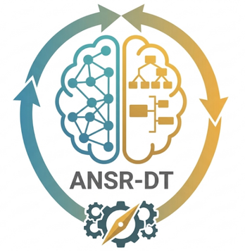
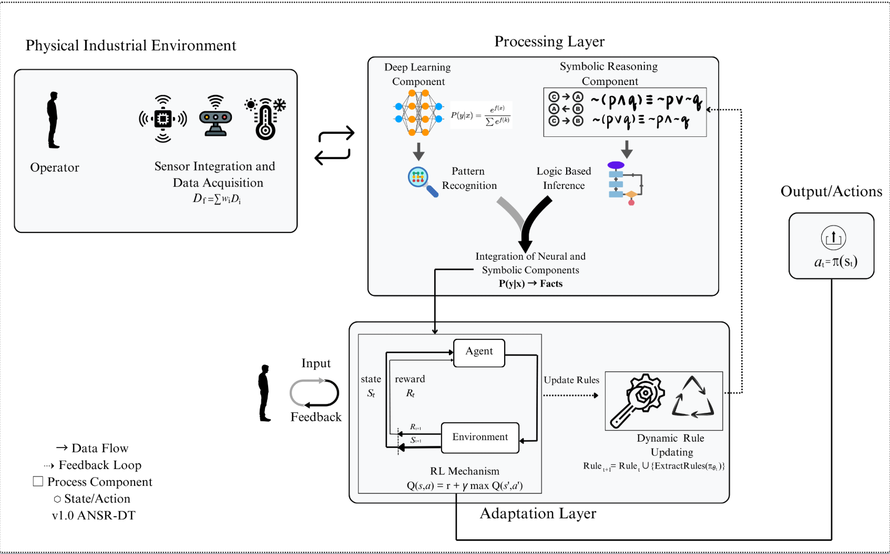

# ANSR-DT

<p align="center">
  
</p>

[](LICENSE)
[](https://www.python.org/)
[](https://problog.readthedocs.io/en/latest/)

ANSR-DT is an adaptive neuro-symbolic framework for digital twins that combines temporal anomaly detection, symbolic reasoning, and reinforcement learning for interpretable monitoring and decision support. The repository contains the core ANSR-DT pipeline, symbolic reasoning components, and a dedicated SKAB validation path.

## Overview

ANSR-DT integrates three main elements:

- CNN-LSTM based temporal pattern learning for anomaly detection.
- Prolog-based symbolic reasoning for explicit rules, explanations, and rule updates.
- PPO-based adaptation for downstream control and policy refinement.

The project supports two complementary evaluation settings:

- A synthetic digital-twin pipeline used for controlled end-to-end ANSR-DT experiments.
- A dedicated SKAB-native path used for real-world benchmark validation on industrial sensor streams.

## Reported Results

ANSR-DT is evaluated in both controlled synthetic digital-twin experiments and a dedicated SKAB-based real-world benchmark setting. The table below summarizes the main reported outcomes.

| Setting | What ANSR-DT demonstrates | Representative outcome |
|---|---|---|
| Synthetic digital-twin benchmark | Strong neuro-symbolic anomaly detection with interpretable reasoning traces | F1 `0.966`, ROC-AUC `0.955` |
| Symbolic scalability | Rule-based inference remains practical as the rule base grows | `100` rules with sub-`6 ms` latency |
| Real-world SKAB validation | The ANSR-DT design transfers to realistic industrial sensor streams through a dedicated SKAB-native adaptation | Symbolic SKAB variant: F1 `0.755`, ROC-AUC `0.859` |
| Overall contribution | ANSR-DT combines prediction, symbolic traceability, and adaptive decision support in one framework | Competitive performance with explicit rules and benchmark-based external validation |

## Architecture



ANSR-DT is organized around a physical sensing layer, a neuro-symbolic processing layer, and an adaptation layer. The core pipeline links multivariate sensor windows to neural anomaly scores, symbolic facts and rules, fused decisions, and optional control actions.

## Installation

### Prerequisites

- Python 3.8+
- Anaconda or another virtual-environment manager
- SWI-Prolog
- ProbLog

### Setup

```bash
git clone https://github.com/sbhakim/ansr-dt.git
cd ansr-dt
conda create -n ansr_dt_env python=3.9
conda activate ansr_dt_env
pip install -r requirements.txt
pip install problog
```

## Quick Start

### Core ANSR-DT pipeline

```bash
python main.py
```

### Dedicated SKAB pipeline

```bash
python -m src.skab.run --config configs/config_skab_separate.yaml
```

The curated local SKAB subset used by this repository is stored under [`data/SKAB`](data/SKAB). That directory includes only the CSV files used by the ANSR-DT SKAB pipeline plus a short local dataset note with external source links.

## Repository Layout

```text
.
├── configs/
│   ├── config.yaml
│   ├── config_skab.yaml
│   └── config_skab_separate.yaml
├── data/
│   ├── SKAB/
│   └── synthetic_sensor_data_with_anomalies.npz
├── main.py
├── src/
│   ├── ansrdt/
│   ├── data/
│   ├── evaluation/
│   ├── inference/
│   ├── models/
│   ├── pipeline/
│   ├── reasoning/
│   ├── rl/
│   ├── skab/
│   ├── training/
│   └── utils/
└── requirements.txt
```

## Publications

### Primary manuscript

```bibtex
@article{hakim2025ansr,
  title={ANSR-DT: An Adaptive Neuro-Symbolic Learning and Reasoning Framework for Digital Twins},
  author={Hakim, Safayat Bin and Adil, Muhammad and Velasquez, Alvaro and Song, Houbing Herbert},
  journal={arXiv preprint arXiv:2501.08561},
  year={2025}
}
```

### Supplementary associated paper

[S. B. Hakim, M. Adil, A. Velasquez and H. H. Song, "An Explainable Neuro-Symbolic Rule Extraction Framework for Digital Twins," 2025 IEEE Smart World Congress (SWC), Calgary, AB, Canada, 2025, pp. 1042-1047.](https://ieeexplore.ieee.org/abstract/document/11395000)  
DOI: `10.1109/SWC65939.2025.00168`

## License

This project is licensed under the MIT License. See [LICENSE](LICENSE).

## Contact

Please open an issue for project questions or contact Safayat Bin Hakim at `safayat DOT b DOT hakim AT gmail DOT com`.
